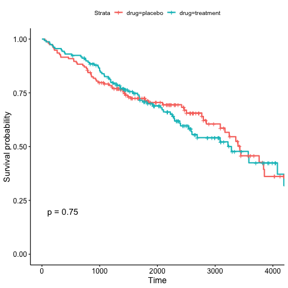
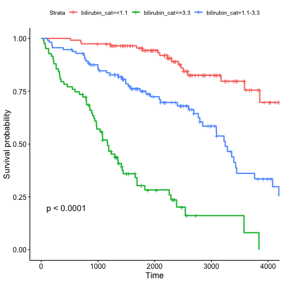

```{r, setup, include = FALSE}
knitr::opts_chunk$set(echo = FALSE, fig.width = 6, fig.height = 6)
```

## Executive summary

```{r exec-summary-stats}
dat <- read.table("../clean_data/data.txt", header = TRUE)
n <- nrow(dat)
table1 <- table(dat$drug)
table2 <- table(dat$bilirubin_cat)
```

There were `r n` patients in the study. There were `r table1[1]` patients receiving the placebo and `r table1[2]` patients receiving the treatment. `r table2[1]` patients has serum bilirubin level <1.1 mg/dl, `r table2[2]` patients has serum bilirubin level berween 1.1 and 3.3 mg/dl, and `r table2[3]` patients has serum bilirubin level >3.3 mg/dl,

## Survival analysis




I used Kepler-Meier estimates to estimate the survival curves by drug and by serum bilirubin level, and then tested whether curves are significantly different by log rank test.  
1. Treatment: $p = 0.75$. There is no significant difference between the survival curves of the treatment and placebo groups.  
2. Serum bilirubin: $p < 0.0001$. There is significant difference between the survival curves of the three serum bilirubin groups.